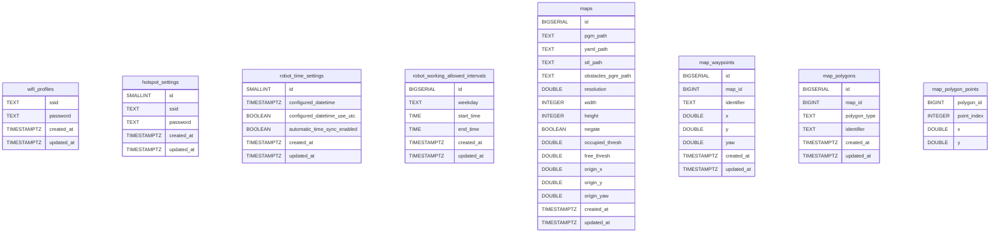

# SQL C++ Wrapper

Header only C++ SQL Wrapper for Postgres database.

Usage examples can be found in `main.cpp`.

## Dependencies

```shell
sudo apt install libcppdb-dev libcppdb-postgresql0
```

## Build

```shell
mkdir build
cd build
cmake ..
make -j
```

## References:
- [CppDB](https://cppcms.com/sql/cppdb/index.html) 
- [Postgres Backend](https://salsa.debian.org/debian/cppdb/-/blob/master/drivers/postgres_backend.cpp) 

### Database used for development:


