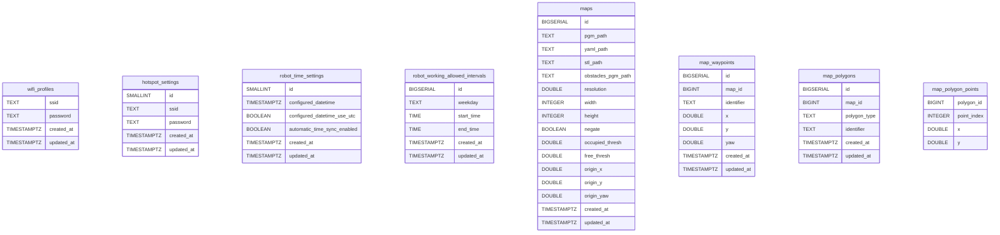

# SQL C++ Wrapper

Header only C++ SQL Wrapper for Postgres database.

Usage examples can be found in `main.cpp`.

## Dependencies

```shell
sudo apt install libcppdb-postgresql0 libpq-dev
```

## Test

```shell
mkdir build
cd build
cmake ..
make -j
./test_app
```

## Usage

```cmake
cmake_minimum_required(VERSION 3.14)
project(my_app)

include(FetchContent)

FetchContent_Declare(
  sql_cpp_wrapper
  GIT_REPOSITORY https://github.com/socialdroids/sql_cpp_wrapper.git
  GIT_TAG v1.0.0
)
FetchContent_MakeAvailable(sql_cpp_wrapper)

add_executable(my_app main.cpp)
target_link_libraries(my_app PRIVATE sql_cpp_wrapper::sql_cpp_wrapper)
sql_wrapper_setup_drivers(my_app)
``` 

## References:
- [CppDB](https://cppcms.com/sql/cppdb/index.html) 
- [Postgres Backend](https://salsa.debian.org/debian/cppdb/-/blob/master/drivers/postgres_backend.cpp) 

### Database used for development:


